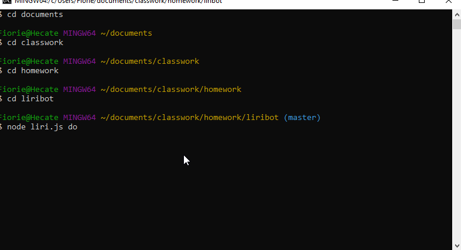

# liribot

LIRI is like iPhone's SIRI. However, while SIRI is a Speech Interpretation and Recognition Interface, LIRI is a Language Interpretation and Recognition Interface. LIRI will be a command line node app that takes in parameters and gives you back data.

<b>This program uses: </b>
Node-Spotify-API 
Axios 
OMDB API 
Bands In Town API 
Moment 
DotEnv 
node.js 
javascript (obv) 

<b>Heres the working product:</b>

